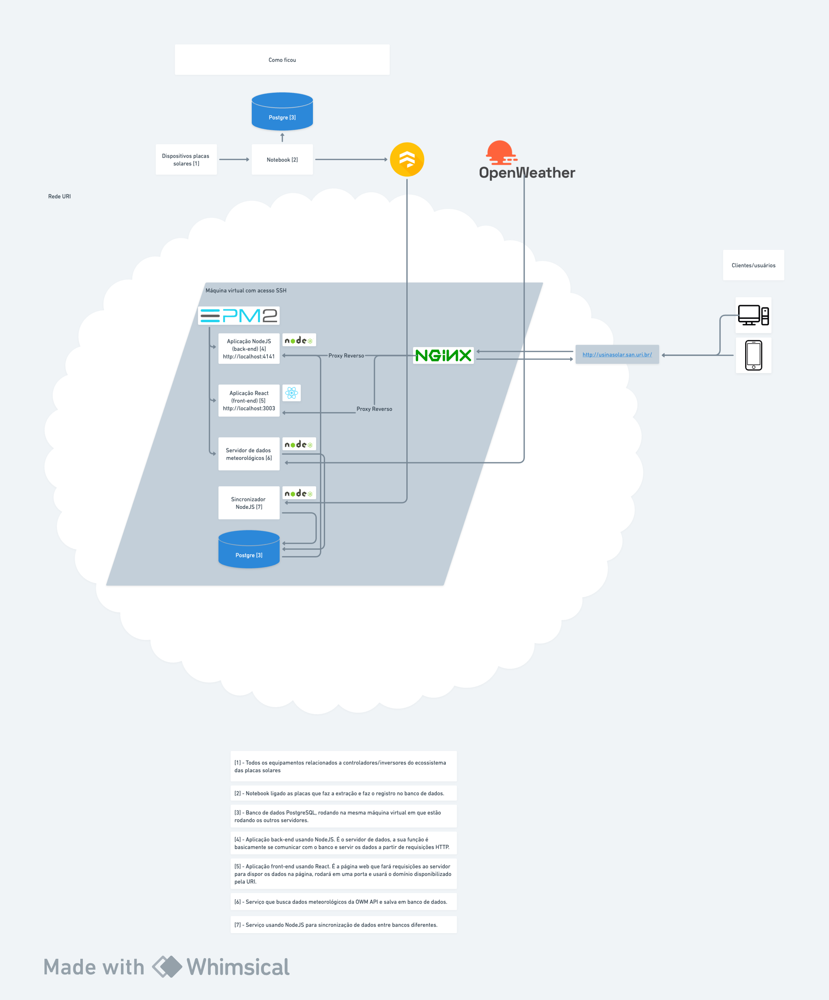

# Solar Releases

The main purpose of this repo, is to maintain all the build versions of all required applications of the solar power plant ecosystem in the server side.

## Architecture

Below you can check the architecture of the entire solar power plant ecosystem.

